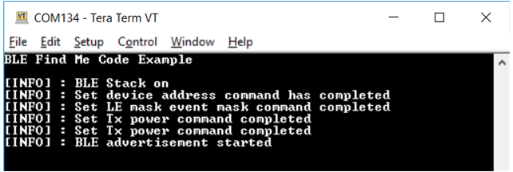
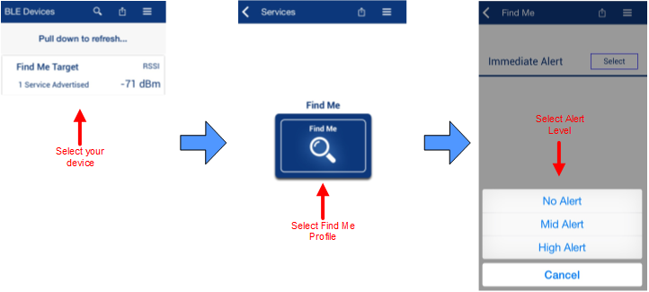
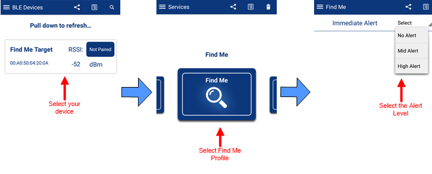
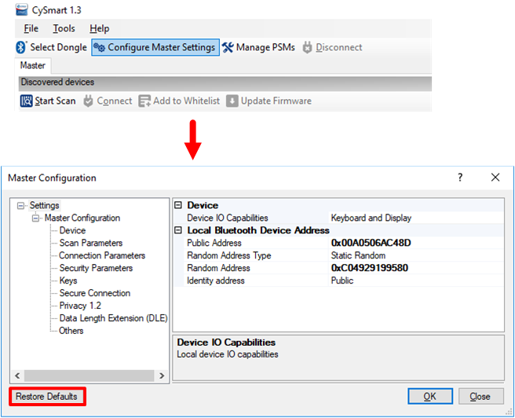
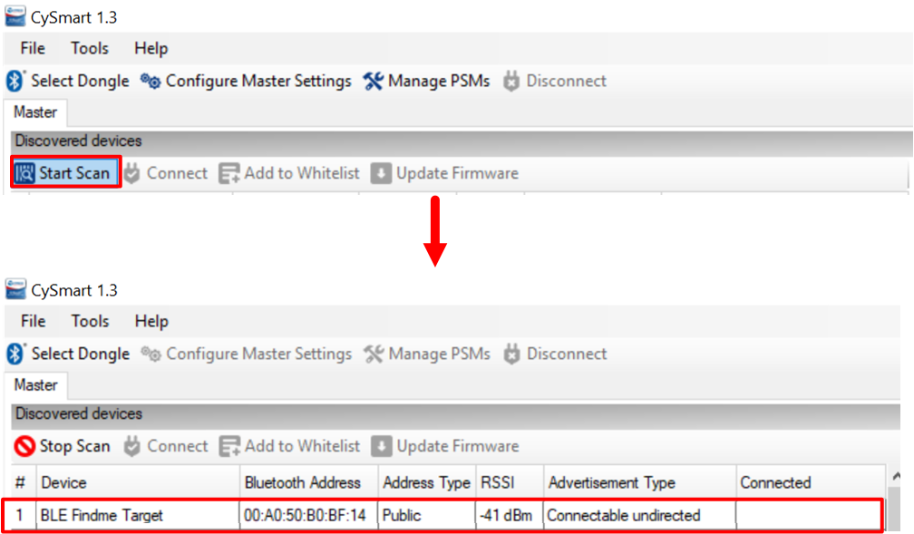
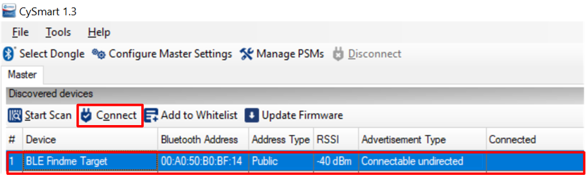
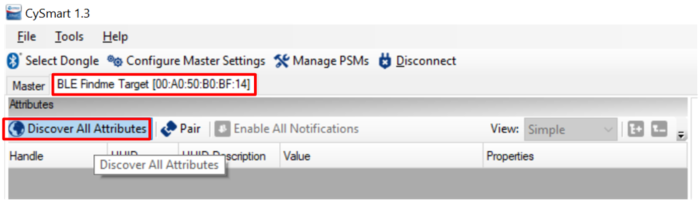
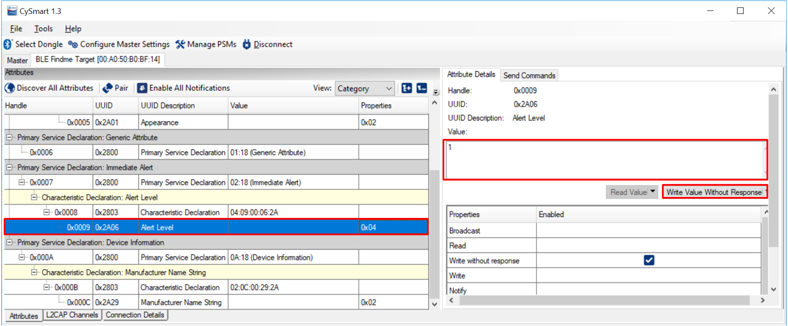
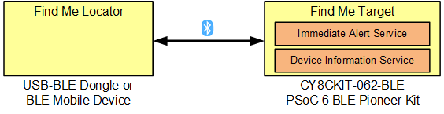

# PSoC 6 MCU with Bluetooth Low Energy Connectivity: Find Me Application

This code example demonstrates the implementation of a simple Bluetooth LE Immediate Alert Service (IAS)-based Find Me Profile (FMP) using PSoC® 6 MCU with Bluetooth Low Energy (Bluetooth LE) Connectivity (PSoC 6 BLE).

This design implements a Bluetooth LE [FMP](https://www.bluetooth.org/docman/handlers/downloaddoc.ashx?doc_id=239389) that consists of an IAS. FMP and [IAS](https://developer.bluetooth.org/gatt/services/Pages/ServiceViewer.aspx?u=org.bluetooth.service.immediate_alert.xml) are Bluetooth LE standard Profile and Service respectively, as defined by the Bluetooth SIG.

The design uses the LEDs on the kit. USER_LED1 indicates the Bluetooth LE advertisement (LED blinking) and connection state (ON for connected, OFF for disconnected). USER_LED2 displays the alert level (OFF, flashing, and ON for no alert, mild alert, and high alert respectively).

The USB-Bluetooth LE dongle provided with the CY8CKIT-062-BLE Pioneer Kit or an iOS/Android mobile device can act as the Bluetooth LE Central device, which locates the Peripheral device.

[Provide feedback on this Code Example.](https://cypress.co1.qualtrics.com/jfe/form/SV_1NTns53sK2yiljn?Q_EED=eyJVbmlxdWUgRG9jIElkIjoiQ0UyMTI3MzYiLCJTcGVjIE51bWJlciI6IjAwMi0xMjczNiIsIkRvYyBUaXRsZSI6IlBTb0MgNiBNQ1Ugd2l0aCBCbHVldG9vdGggTG93IEVuZXJneSBDb25uZWN0aXZpdHk6IEZpbmQgTWUgQXBwbGljYXRpb24iLCJyaWQiOiJuaGVnIiwiRG9jIHZlcnNpb24iOiIyLjAuMCIsIkRvYyBMYW5ndWFnZSI6IkVuZ2xpc2giLCJEb2MgRGl2aXNpb24iOiJNQ0QiLCJEb2MgQlUiOiJJQ1ciLCJEb2MgRmFtaWx5IjoiUFNPQyJ9)

## Requirements

- [ModusToolbox® software](https://www.cypress.com/products/modustoolbox-software-environment) v2.2

    **Note:** This code example version requires ModusToolbox software version 2.2 or later and is not backward compatible with v2.1 or older versions. If you cannot move to ModusToolbox v2.2, use the latest compatible version of this example: [latest-v1.X](https://github.com/cypresssemiconductorco/mtb-example-psoc6-ble-findme/tree/latest-v1.X).
- Board Support Package (BSP) minimum required version: 2.0.0
- Programming Language: C
- Associated Parts: All [PSoC® 6 MCU](http://www.cypress.com/PSoC6) parts with Bluetooth LE connectivity

## Supported Toolchains (make variable 'TOOLCHAIN')

- GNU Arm® Embedded Compiler v9.3.1 (`GCC_ARM`) - Default value of `TOOLCHAIN`
- Arm compiler v6.13 (`ARM`)
- IAR C/C++ compiler v8.42.2 (`IAR`)

## Supported Kits (make variable 'TARGET')

- [PSoC 6 BLE Pioneer Kit](https://www.cypress.com/CY8CKIT-062-BLE) (`CY8CKIT-062-BLE`) - Default value of `TARGET`
- [PSoC 6 BLE Prototyping Kit](https://www.cypress.com/CY8CPROTO-063-BLE) (`CY8CPROTO-063-BLE`)

## Hardware Setup

This example uses the board's default configuration. See the kit user guide to ensure that the board is configured correctly.

**Note:** The PSoC 6 BLE Pioneer Kit (CY8CKIT-062-BLE) and the PSoC 6 WiFi-BT Pioneer Kit (CY8CKIT-062-WIFI-BT) ship with KitProg2 installed. The ModusToolbox software requires KitProg3. Before using this code example, make sure that the board is upgraded to KitProg3. The tool and instructions are available in the [Firmware Loader](https://github.com/cypresssemiconductorco/Firmware-loader) GitHub repository. If you do not upgrade, you will see an error like "unable to find CMSIS-DAP device" or "KitProg firmware is out of date".

## Software Setup

Install a terminal emulator if you don't have one. Instructions in this document use [Tera Term](https://ttssh2.osdn.jp/index.html.en).

This code example consists of two parts: a locator and a target.

For the locator, download and install either the [CySmart Host Emulation Tool](http://cypress.com/cysmart) PC application or the CySmart app for iOS or Android. You can test the behavior with any of the two options, but the CySmart app is simpler.

Scan the following QR codes from your mobile phone to download the CySmart app.


## Using the Code Example

Create the project and open it using one of the following:

<details><summary><b>In Eclipse IDE for ModusToolbox</b></summary>

1. Click the **New Application** link in the **Quick Panel** (or, use **File** > **New** > **ModusToolbox Application**). This launches the [Project Creator](http://www.cypress.com/ModusToolboxProjectCreator) tool.

2. Pick a kit supported by the code example from the list shown in the **Project Creator - Choose Board Support Package (BSP)** dialog.

   When you select a supported kit, the example is reconfigured automatically to work with the kit. To work with a different supported kit later, use the [Library Manager](https://www.cypress.com/ModusToolboxLibraryManager) to choose the BSP for the supported kit. You can use the Library Manager to select or update the BSP and firmware libraries used in this application. To access the Library Manager, click the link from the **Quick Panel**.

   You can also just start the application creation process again and select a different kit.

   If you want to use the application for a kit not listed here, you may need to update the source files. If the kit does not have the required resources, the application may not work.

3. In the **Project Creator - Select Application** dialog, choose the example by enabling the checkbox.

4. Optionally, change the suggested **New Application Name**.

5. Enter the local path in the **Application(s) Root Path** field to indicate where the application needs to be created.

   Applications that can share libraries can be placed in the same root path.

6. Click **Create** to complete the application creation process.

For more details, see the [Eclipse IDE for ModusToolbox User Guide](https://www.cypress.com/MTBEclipseIDEUserGuide) (locally available at *{ModusToolbox install directory}/ide_{version}/docs/mt_ide_user_guide.pdf*).

</details>

<details><summary><b>In Command-line Interface (CLI)</b></summary>

ModusToolbox provides the Project Creator as both a GUI tool and a command line tool to easily create one or more ModusToolbox applications. See the "Project Creator Tools" section of the [ModusToolbox User Guide](https://www.cypress.com/ModusToolboxUserGuide) for more details.

Alternatively, you can manually create the application using the following steps:

1. Download and unzip this repository onto your local machine, or clone the repository.

2. Open a CLI terminal and navigate to the application folder.

   On Linux and macOS, you can use any terminal application. On Windows, open the **modus-shell** app from the Start menu.

   **Note:** The cloned application contains a default BSP file (*TARGET_xxx.mtb*) in the *deps* folder. Use the [Library Manager](https://www.cypress.com/ModusToolboxLibraryManager) (`make modlibs` command) to select and download a different BSP file, if required. If the selected kit does not have the required resources or is not [supported](#supported-kits-make-variable-target), the application may not work.

3. Import the required libraries by executing the `make getlibs` command.

Various CLI tools include a `-h` option that prints help information to the terminal screen about that tool. For more details, see the [ModusToolbox User Guide](https://www.cypress.com/ModusToolboxUserGuide) (locally available at *{ModusToolbox install directory}/docs_{version}/mtb_user_guide.pdf*).

</details>

<details><summary><b>In Third-party IDEs</b></summary>

1. Follow the instructions from the **In Command-line Interface (CLI)** section to create the application, and import the libraries using the `make getlibs` command.

2. Export the application to a supported IDE using the `make <ide>` command.

    For a list of supported IDEs and more details, see the "Exporting to IDEs" section of the [ModusToolbox User Guide](https://www.cypress.com/ModusToolboxUserGuide) (locally available at *{ModusToolbox install directory}/docs_{version}/mtb_user_guide.pdf*.

3. Follow the instructions displayed in the terminal to create or import the application as an IDE project.

</details>

## Operation

1. Connect the board to your PC using the provided USB cable through the KitProg3 USB connector.

2. Open a terminal program and select the KitProg3 COM port. Set the serial port parameters to 8N1 and 115200 baud.

3. Program the board using one of the following:

   <details><summary><b>Using Eclipse IDE for ModusToolbox</b></summary>

      1. Select the application project in the Project Explorer.

      2. In the **Quick Panel**, scroll down, and click **\<Application Name> Program (KitProg3_MiniProg4)**.
      </details>

   <details><summary><b>Using CLI</b></summary>

     From the terminal, execute the `make program` command to build and program the application using the default toolchain to the default target. You can specify a target and toolchain manually:
      ```
      make program TARGET=<BSP> TOOLCHAIN=<toolchain>
      ```

      Example:
      ```
      make program TARGET=CY8CKIT-062-BLE TOOLCHAIN=GCC_ARM
      ```
</details>

4. After programming, USER_LED1 starts blinking, indicating that Bluetooth LE is advertising, and prints a message on the terminal application as shown in Figure 1.

   **Figure 1. Terminal Output**

   

5. To test using the CySmart mobile app:
   1. Turn ON Bluetooth on your Android or iOS device.

   2. Launch the CySmart app.

   3. Press the reset switch on the kit to start Bluetooth LE advertisements from your design. USER_LED1 starts toggling, indicating that Bluetooth LE advertisement has started.

   4. Pull down the CySmart app home screen to start scanning for Bluetooth LE Peripherals; your device appears in the CySmart app home screen. Select your device to establish a Bluetooth LE connection. Once the connection is established, USER_LED1 stays ON.

   5. Select the 'Find Me' Profile from the carousel view.

   6. Select an Alert Level value on the Find Me Profile screen. Observe that the state of USER_LED2 on the device changes based on the alert level.

      **Figure 2. Testing with the CySmart App on iOS**

      

      **Figure 3. Testing with the CySmart App on Android**

      

5. To test using the CySmart Host Emulation Tool:

   1. Connect the Bluetooth LE Dongle to your Windows PC. Wait for the driver installation to complete.

   2. Launch the CySmart Host Emulation Tool.

      **Note:** If the dongle firmware is outdated, you will be alerted. You must upgrade the firmware before you can complete this step.
      Follow the instructions in the window to update the dongle firmware.

   3. Select **Configure Master Settings** and then click **Restore Defaults**, as shown in Figure 4. Then, click **OK**.

      **Figure 4. CySmart Master Settings Configuration**

      

   4. Press the reset switch on the Pioneer Kit to start Bluetooth LE advertisements from your design.

   5. On the CySmart Host Emulation Tool, click **Start Scan**. Your device name (configured as Find Me Target) should appear in the **Discovered devices** list, as shown in Figure 5.

      **Figure 5. CySmart Device Discovery**

      

   6. Select your device and click **Connect** to establish a Bluetooth LE connection between the CySmart Host Emulation Tool and your device, as shown in Figure 6.

      **Figure 6. CySmart Device Connection**

      

   7. Once connected, switch to the Find Me Target device tab and discover all Attributes on your design from the CySmart Host Emulation Tool, as shown in Figure 7.

      **Figure 7. CySmart Attribute Discovery**

      

   8. Scroll down the Attributes window and locate the Immediate Alert Service fields. Write a value of 0 – no alert, 1 – mild alert, or 2 – high alert to the Alert Level Characteristic under the Immediate Alert Service, as Figure 8 shows. Observe that the state of the LED on your device changes per your Alert Level Characteristic configuration.

      **Figure 8. Testing with CySmart Host Emulation Tool**

      

## Debugging

You can debug the example to step through the code. In the IDE, use the **\<Application Name> Debug (KitProg3_MiniProg4)** configuration in the **Quick Panel**. For more details, see the "Program and Debug" section in the [Eclipse IDE for ModusToolbox User Guide](https://www.cypress.com/MTBEclipseIDEUserGuide).

**Note:** **(Only while debugging)** On the CM4 CPU, some code in `main()` may execute before the debugger halts at the beginning of `main()`. This means that some code executes twice - once before the debugger stops execution, and again after the debugger resets the program counter to the beginning of `main()`. See [KBA231071](https://community.cypress.com/docs/DOC-21143) to learn about this and for the workaround.

## Design and Implementation

The ‘Find Me Locator’ (the Bluetooth LE Central device) is a Bluetooth LE GATT Client. The ‘Find Me Target’ (the Peripheral device) is a Bluetooth LE GATT Server with the IAS and an additional Device Information Service implemented, as Figure 9 shows.

**Figure 9. Find Me Service Relationship**



The Bluetooth LE Find Me profile defines what happens when the locating Central device broadcasts a change in the alert level. The Find Me locator performs service discovery using the 'GATT Discover All Primary Services' procedure. The Bluetooth LE Service Characteristic discovery is done by the 'Discover All Characteristics of a Service' procedure. When the Find Me Locator wants to cause an alert on the Find Me Target, it writes an alert level in the Alert Level Characteristic of the IAS. When the Find Me Target receives an alert level, it indicates the level using the user LED2: OFF for no alert, blinking for mild alert, and ON for high alert.

### Resources and Settings

**Table 1. Application Resources**

| Resource  |  Alias/Object     |    Purpose     |
| :-------  | :------------    | :------------ |
| UART (HAL) |cy_retarget_io_uart_obj   | UART HAL object used by Retarget-IO for Debug UART port |
| GPIO (HAL) | CYBSP_USER_LED1 and CYBSP_USER_LED2| User LEDs to show Bluetooth LE connection/advertisement state and Alert level|
| GPIO (HAL) | CYBSP_USER_BTN           | User button to wake up the device from hibernate mode|
|LPTIMER (HAL)| wakeup_timer             | To blink the LED periodically |
| SYSPM (HAL)| ----                      | To put the CM4 core into Deep Sleep and Hibernate mode|

The Bluetooth LE interface is implemented on a PSoC 6 MCU with Bluetooth LE Connectivity device using the Bluetooth LE resource. The application runs on the Arm® Cortex®-M4 CPU.

See [AN210781 – Getting Started with PSoC 6 MCU with Bluetooth Low Energy (BLE) Connectivity](http://www.cypress.com/an210781) to understand the design of firmware for this code example. The device enters low-power deep sleep mode when Bluetooth LE is idle. It wakes up automatically when there is activity on the Bluetooth LE connection.

When Bluetooth LE is disconnected, the device enters hibernate mode. It wakes up when the reset switch or user button (SW2) is pressed and performs a complete reset sequence in firmware. The syspm Hardware Abstraction Layer (HAL) driver is used for deep sleep and hibernate modes.

User LEDs indicate the state of the Bluetooth LE advertisement/connection and alert level written by the Bluetooth LE Central. The lptimer HAL driver is used to blink the LEDs even when the system is in deep sleep.

The application uses a UART resource from the HAL to print debug messages on a UART terminal emulator. The UART resource initialization and retargeting of standard I/O to the UART port are done using the [retarget-io](https://github.com/cypresssemiconductorco/retarget-io) library.

The project uses [Bluetooth Low Energy Middleware](https://github.com/cypresssemiconductorco/bless); see [PSoC 6 Bluetooth LE Middleware API Reference Guide](https://cypresssemiconductorco.github.io/bless/ble_api_reference_manual/html/index.html) for more information on APIs. The [Quick Start](https://cypresssemiconductorco.github.io/bless/ble_api_reference_manual/html/page_ble_quick_start.html) section of the PSoC 6 Bluetooth LE Middleware API Reference Guide describes the step-by-step instructions to configure and launch PSoC 6 Bluetooth LE Middleware.

## Related Resources

| Application Notes                                            |                                                              |
| :----------------------------------------------------------- | :----------------------------------------------------------- |
| [AN228571](https://www.cypress.com/AN228571) – Getting Started with PSoC 6 MCU on ModusToolbox | Describes PSoC 6 MCU devices and how to build your first application with ModusToolbox |
| [AN221774](https://www.cypress.com/AN221774) – Getting Started with PSoC 6 MCU on PSoC Creator | Describes PSoC 6 MCU devices and how to build your first application with PSoC Creator |
| [AN210781](https://www.cypress.com/AN210781) – Getting Started with PSoC 6 MCU with Bluetooth Low Energy (BLE) Connectivity on PSoC Creator | Describes PSoC 6 MCU with Bluetooth LE Connectivity devices and how to build your first application with PSoC Creator |
| [AN215656](https://www.cypress.com/AN215656) – PSoC 6 MCU: Dual-CPU System Design | Describes the dual-CPU architecture in PSoC 6 MCU, and shows how to build a simple dual-CPU design |
| **Code Examples**                                            |                                                              |
| [Using ModusToolbox](https://github.com/cypresssemiconductorco/Code-Examples-for-ModusToolbox-Software) | [Using PSoC Creator](https://www.cypress.com/documentation/code-examples/psoc-6-mcu-code-examples) |
| **Device Documentation**                                     |                                                              |
| [PSoC 6 MCU Datasheets](https://www.cypress.com/search/all?f[0]=meta_type%3Atechnical_documents&f[1]=resource_meta_type%3A575&f[2]=field_related_products%3A114026) | [PSoC 6 Technical Reference Manuals](https://www.cypress.com/search/all/PSoC%206%20Technical%20Reference%20Manual?f[0]=meta_type%3Atechnical_documents&f[1]=resource_meta_type%3A583) |
| **Development Kits**                                         | Buy at www.cypress.com                                       |
| [CY8CKIT-062-BLE](https://www.cypress.com/CY8CKIT-062-BLE) PSoC 6 BLE Pioneer Kit | [CY8CKIT-062-WiFi-BT](https://www.cypress.com/CY8CKIT-062-WiFi-BT) PSoC 6 WiFi-BT Pioneer Kit |
| [CY8CPROTO-063-BLE](https://www.cypress.com/CY8CPROTO-063-BLE) PSoC 6 BLE Prototyping Kit | [CY8CPROTO-062-4343W](https://www.cypress.com/CY8CPROTO-062-4343W) PSoC 6 Wi-Fi BT Prototyping Kit |
| [CY8CKIT-062S2-43012](https://www.cypress.com/CY8CKIT-062S2-43012) PSoC 62S2 Wi-Fi BT Pioneer Kit | [CY8CPROTO-062S3-4343W](https://www.cypress.com/CY8CPROTO-062S3-4343W) PSoC 62S3 Wi-Fi BT Prototyping Kit |
| [CYW9P62S1-43438EVB-01](https://www.cypress.com/CYW9P62S1-43438EVB-01) PSoC 62S1 Wi-Fi BT Pioneer Kit | [CYW9P62S1-43012EVB-01](https://www.cypress.com/CYW9P62S1-43012EVB-01) PSoC 62S1 Wi-Fi BT Pioneer Kit |
| [CY8CKIT-064B0S2-4343W](http://www.cypress.com/CY8CKIT-064B0S2-4343W) PSoC 64 Secure Boot Wi-Fi BT Pioneer Kit |            |
| **Libraries**                                                |                                                              |
| PSoC 6 Peripheral Driver Library (PDL) and docs  | [mtb-pdl-cat1](https://github.com/cypresssemiconductorco/mtb-pdl-cat1) on GitHub |
| Cypress Hardware Abstraction Layer (HAL) Library and docs    | [mtb-hal-cat1](https://github.com/cypresssemiconductorco/mtb-hal-cat1) on GitHub |
| Retarget IO - A utility library to retarget the standard input/output (STDIO) messages to a UART port | [retarget-io](https://github.com/cypresssemiconductorco/retarget-io) on GitHub |
| **Middleware**                                               |                                                              |
| Bluetooth Low Energy Middleware                              | [bless](https://github.com/cypresssemiconductorco/bless) on GitHub |
| CapSense® library and docs                                    | [capsense](https://github.com/cypresssemiconductorco/capsense) on GitHub |
| Links to all PSoC 6 MCU Middleware                           | [psoc6-middleware](https://github.com/cypresssemiconductorco/psoc6-middleware) on GitHub |
| **Tools**                                                    |                                                              |
| [Eclipse IDE for ModusToolbox](https://www.cypress.com/modustoolbox) | The cross-platform, Eclipse-based IDE for IoT designers that supports application configuration and development targeting converged MCU and wireless systems. |
| [PSoC Creator™](https://www.cypress.com/products/psoc-creator-integrated-design-environment-ide) | The Cypress IDE for PSoC and FM0+ MCU development. |

## Other Resources

Cypress provides a wealth of data at www.cypress.com to help you select the right device, and quickly and effectively integrate it into your design.

For PSoC 6 MCU devices, see [How to Design with PSoC 6 MCU - KBA223067](https://community.cypress.com/docs/DOC-14644) in the Cypress community.

## Document History

Document Title: *CE212736* - *PSoC 6 MCU with Bluetooth Low Energy Connectivity: Find Me Application*


| Version | Description of Change |
| ------- | --------------------- |
| 1.0.0   | New code example      |
| 1.0.1   | Fixed image alignment issues |
| 1.1.0   | Updated to support ModusToolbox software v2.1<br /> Updated to use HAL drivers for power management |
| 2.0.0   | Major update to support ModusToolbox software v2.2, <br /> This version is not backward compatible with ModusToolbox software v2.1  |
------

All other trademarks or registered trademarks referenced herein are the property of their respective owners.


-------------------------------------------------------------------------------

© Cypress Semiconductor Corporation (An Infineon Technologies Company), 2020 - 2021. This document is the property of Cypress Semiconductor Corporation and its affiliates ("Cypress"). This document, including any software or firmware included or referenced in this document ("Software"), is owned by Cypress under the intellectual property laws and treaties of the United States and other countries worldwide. Cypress reserves all rights under such laws and treaties and does not, except as specifically stated in this paragraph, grant any license under its patents, copyrights, trademarks, or other intellectual property rights. If the Software is not accompanied by a license agreement and you do not otherwise have a written agreement with Cypress governing the use of the Software, then Cypress hereby grants you a personal, non-exclusive, nontransferable license (without the right to sublicense) (1) under its copyright rights in the Software (a) for Software provided in source code form, to modify and reproduce the Software solely for use with Cypress hardware products, only internally within your organization, and (b) to distribute the Software in binary code form externally to end users (either directly or indirectly through resellers and distributors), solely for use on Cypress hardware product units, and (2) under those claims of Cypress's patents that are infringed by the Software (as provided by Cypress, unmodified) to make, use, distribute, and import the Software solely for use with Cypress hardware products. Any other use, reproduction, modification, translation, or compilation of the Software is prohibited.<br />
TO THE EXTENT PERMITTED BY APPLICABLE LAW, CYPRESS MAKES NO WARRANTY OF ANY KIND, EXPRESS OR IMPLIED, WITH REGARD TO THIS DOCUMENT OR ANY SOFTWARE OR ACCOMPANYING HARDWARE, INCLUDING, BUT NOT LIMITED TO, THE IMPLIED WARRANTIES OF MERCHANTABILITY AND FITNESS FOR A PARTICULAR PURPOSE. No computing device can be absolutely secure. Therefore, despite security measures implemented in Cypress hardware or software products, Cypress shall have no liability arising out of any security breach, such as unauthorized access to or use of a Cypress product. CYPRESS DOES NOT REPRESENT, WARRANT, OR GUARANTEE THAT CYPRESS PRODUCTS, OR SYSTEMS CREATED USING CYPRESS PRODUCTS, WILL BE FREE FROM CORRUPTION, ATTACK, VIRUSES, INTERFERENCE, HACKING, DATA LOSS OR THEFT, OR OTHER SECURITY INTRUSION (collectively, "Security Breach"). Cypress disclaims any liability relating to any Security Breach, and you shall and hereby do release Cypress from any claim, damage, or other liability arising from any Security Breach. In addition, the products described in these materials may contain design defects or errors known as errata which may cause the product to deviate from published specifications. To the extent permitted by applicable law, Cypress reserves the right to make changes to this document without further notice. Cypress does not assume any liability arising out of the application or use of any product or circuit described in this document. Any information provided in this document, including any sample design information or programming code, is provided only for reference purposes. It is the responsibility of the user of this document to properly design, program, and test the functionality and safety of any application made of this information and any resulting product. "High-Risk Device" means any device or system whose failure could cause personal injury, death, or property damage. Examples of High-Risk Devices are weapons, nuclear installations, surgical implants, and other medical devices. "Critical Component" means any component of a High-Risk Device whose failure to perform can be reasonably expected to cause, directly or indirectly, the failure of the High-Risk Device, or to affect its safety or effectiveness. Cypress is not liable, in whole or in part, and you shall and hereby do release Cypress from any claim, damage, or other liability arising from any use of a Cypress product as a Critical Component in a High-Risk Device. You shall indemnify and hold Cypress, its directors, officers, employees, agents, affiliates, distributors, and assigns harmless from and against all claims, costs, damages, and expenses, arising out of any claim, including claims for product liability, personal injury or death, or property damage arising from any use of a Cypress product as a Critical Component in a High-Risk Device. Cypress products are not intended or authorized for use as a Critical Component in any High-Risk Device except to the limited extent that (i) Cypress's published data sheet for the product explicitly states Cypress has qualified the product for use in a specific High-Risk Device, or (ii) Cypress has given you advance written authorization to use the product as a Critical Component in the specific High-Risk Device and you have signed a separate indemnification agreement.<br />
Cypress, the Cypress logo, Spansion, the Spansion logo, and combinations thereof, WICED, PSoC, CapSense, EZ-USB, F-RAM, and Traveo are trademarks or registered trademarks of Cypress in the United States and other countries. For a more complete list of Cypress trademarks, visit cypress.com. Other names and brands may be claimed as property of their respective owners.
